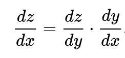
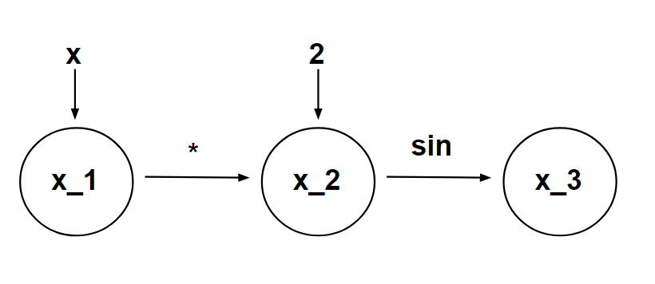
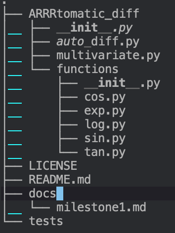

# Introduction

Our software package is an automatic differentiation suite that solves the problem of numerically computing the derivative for an arbitrary function as long as that function can be expressed as the composition of elementary functions. Precise computation of the gradient is of fundamental importance in the sciences and applied mathematics. Many optimization algorithms rely on gradient information. Indeed, the backpropagation algorithm, which is used to train neural networks, is simply gradient descent on the network's weights. Derivatives are also used in root finding methods such as Newton's method, which are used to numerically solve ordinary differential equations when using implicit methods, among other things. Reliable solutions to ODEs are integral to many of the applied sciences. Automatic differentiation offers an improvement over finite difference methods in that automatic differentiation is exact to machine precision and does not suffer nearly as much from numerical stability issues. AD is also better than symbolic differentiation in that it is less computationally expensive.

# Background

A derivative of a univariate function represents the instantaneous rate of change of that function at a particular point. A vector containing each partial derivative of a multivariate function is known as a gradient and gives the direction of greatest increase at a particular point. A Jacobian of a vector-valued function is a matrix where each row contains the gradient of the corresponding function.

Forward-mode automatic differentiation of a function can be conceptualized as 

1. Dividing that function into a composition of elementary operations through a computational graph. Basic elementary operations include:
    1. Addition
    2. Multiplication
    3. Subtraction
    4. Division
    5. Exponentiation
    6. Logarithms
    7. Trigonometric functions
    
2. Iteratively applying the chain rule, a result from univariate calculus for computing the derivative of a composite function, at each step of the computational graph from beginning to end in order to propagate the exact numeric values of the partial derivatives all the way until the final step of the computational graph, which represents the output of the function. The partial derivatives at the final step are with respect to the function's variables and so represent the numeric value of the gradient for a chosen value of the function's variables.

The chain rule describes the differentiation of a composite function, where the derivatives are taken at each step as described by the following diagram: 



The procedure described above allows for numerical gradient computations of particular classes of multivariate, scalar-valued functions, and can easily be extended to vector-valued functions as well -- simply apply the procedure component-wise to each function.

We illustrate both the graph structure of computations as well as the propagation of the derivatives via the chain rule with an example. As each step in automatic differentiation involves a single elementary function, each of these "steps" can be used as input into an outer function. An example of forward-mode automatic differentiation of the function *sin(2x)* can be seen below, where *x<sub>n</sub>* represents the *n*th step of the function. 



| trace | func        | value   | deriv                 |   dx1 |
|-------|-------------|---------|-----------------------|-------|
| *x<sub>1</sub>* | *x<sub>1</sub>*       | 5     | 1           |     1 |
| *x<sub>2</sub>* | 2*x<sub>1</sub>*      | 10    | 2d*x<sub>1</sub>*          |     2 |
| *x<sub>3</sub>* | sin(*x<sub>2</sub>*) | -.544 | cos(*x<sub>2</sub>*)*dx<sub>2</sub>* | -1.68 |

Essentially, we divide the composite function sin(2x) into the elementary operations *x<sub>1</sub>*=x, *x<sub>2</sub>*=2*x<sub>1</sub>*, and *x<sub>3</sub>*=sin(*x<sub>2</sub>*), and we maintain the derivatives along the way. 

It is also useful to give some background on dual numbers. Dual numbers are numbers of the form *a+bε*. In the case of automatic differentiation, the *ε* value can be used to represent the derivative of the function at a particular value *x*. For example, an element *x* would be represented as the vector *(x,x')*. A simple application of a function *f* might look like *f((x,x')) = (f(x), f(x)x')*, making use of the chain rule as described above. 

# How to use ARRRtomatic_diff

We envision that a user will interact with our package by instantiating our core auto diff variable object and then composing complicated functions through the primitives exposed by our API. They would import the AutoDiffVariable object as well as the elementary functions we provide.

We provide an example below:

```python
from arrrtodiff import AutoDiffVariable
import arrrtodiff.functions as adfuncs

beta_0 = AutoDiff(name='b0', val=-3)
beta_1 = AutoDiff(name='b1', val=4)

for i in len(y):
    f += (y[i] - (beta_0 + beta_1 * x[i]))**2

f = f/len(y)

grad = f.get_gradient()

{
    'b0': ...,
    'b1': ...
}
```

# Software Organization

We expect the directory structure to look similar to the following:



<!-- . -->
<!-- ├── ARRRtomatic_diff -->
<!-- │   ├── __init__.py -->
<!-- │   ├── auto_diff.py -->
<!-- │   ├── multivariate.py -->
<!-- │   └── functions -->
<!-- │       ├── __init__.py -->
<!-- │       ├── cos.py -->
<!-- │       ├── exp.py -->
<!-- │       ├── log.py -->
<!-- │       ├── sin.py -->
<!-- │       └── tan.py -->
<!-- ├── LICENSE -->
<!-- ├── README.md -->
<!-- ├── docs -->
<!-- │   └── milestone1.md -->
<!-- └── tests -->

We will distribute our package via PyPI, since it is the standard repository for Python packages, and will enable users to install our package using pip, with which most Python users will be familiar.  

We will include the auto_diff module which defines the AutoDiffVariable object in our computational graph. This variable will overload elementary operations such as `__add__` to not only maintain the current value in the computational graph / trace table but also all of the partial derivatives for all named variables. We will also have modules for each elementary function (e.g. exp, log, sin, etc.). These functions will use duck typing to attempt to update values and partial derivatives if passed an AutoDiffVariable object, otherwise they will assume the input is a numeric primitive.

We plan to maintain a test suite in another directory (specified 'tests' in the hierarchy above) and will use both TravisCI and CodeCov. We also plan to follow PEP 257 https://www.python.org/dev/peps/pep-0257/ for our documentation.

We will use setuptools (https://packaging.python.org/tutorials/packaging-projects/) to package our software. This seems to be standard approach within the Python community, and we believe that it is important to adhere to standards.


# Implementation

We plan on implementing the forward mode of automatic differentiation through operator overloading and defining custom functions for cases where operator overloading does not make sense (i.e. exp, sin, etc.). That is, for each of the elementary operations (add, subtract, etc.), we will overload the appropriate dunder method in our core auto diff variable class. Note that for each of the elementary operations, this also includes overloading the reverse operands (`__rmul__`, `__radd__`, etc.). The overloaded methods will appropriately update both the value and all the partial derivatives. These will work for any real number the user enters.  

Our core data structure will be a representation of a particular row in the trace table, which in turn corresponds to a step in the computational graph. Users will instantiate named variables that represent root nodes in the computational graph (which corresponds to the inputs to the *n* initial rows of the trace table, where *n* represents the number of input variables). Users will then be able to create arbitrarily complicated functions by manipulating these variables with elementary operations. At every step the package will be able to output the derivative and the function value. Once the user has finished composing a function, our package's output will then be the final derivative and function value.  

This will be implemented via the AutoDiffVariable class, which will handle all of the operator overloading. AutoDiffVariable objects can be combined through elementary operations to yield a new AutoDiffVariable object that has the appropriate value and partial derivatives. 

The AutoDiffVariable class will expose a few methods, namely get_named_variables, get_value, and get_gradient. The user will access get_gradient when they have finished writing their computational graph. As for attributes, the AutoDiffVariable class will simply maintain the names of its variables as well as a dictionary which contains the value of the function and its partial derivatives.

We will use NumPy for elementary computations. Beyond benefitting our package with its speed and versatility, NumPy's prevalence among the Python programming community will allow those interested to more easily understand how our packages operates "under the hood," especially to understand which operators we have overloaded.  

Beyond NumPy, our package will not have other external dependencies.

We will create additional modules for each elementary function. Each module will contain a function that will update an AutoDiffVariable object accordingly. For example, "adfuncs.exp(x)" would exponentiate the value and then multiply each partial derivative by the new exponentiated value. The variable "x" would then point to that updated value. 

We expect this approach to be robust enough to handle vector valued functions with vector inputs. We envision creating convenience methods if a user wishes to work in a multivariate setting (i.e. we'll create convenience classes to create vectors of AutoDiffVariables and allow for broadcasting operations on iterables of AutoDiffVariable objects).


